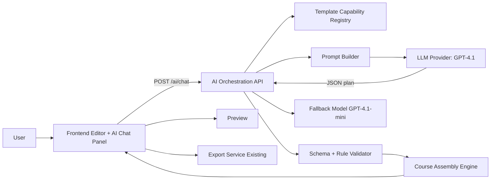

# AI Detailed Architecture and Step-by-Step Implementation Plan

Date: 2026-05-22
Branch: demo-course-AI
Scope: AI-assisted course generation for demo templates while preserving existing manual authoring.

---

## 1) Executive Summary

This plan adds AI as a parallel authoring path, not a replacement.

User can choose either:
- Manual course creation (existing)
- Build with AI (new)

AI path takes storyboard/content + instructions, selects from approved templates, fills template data, renders in existing UI, supports iterative chat refinements, and uses existing preview/export flow.

In-scope templates:
- Text Content
- Tabs
- Accordion
- Click & Reveal
- Final Assessment

Primary model:
- GPT-4.1

Fallback model:
- GPT-4.1-mini

---

## 2) Architectural Principles

1. Preserve Existing Product Behavior
- Manual flow remains unchanged.
- Existing rendering, state management, preview, and export stay the source of truth.

2. Add AI as a Layer, Not as Inline Hacks
- AI orchestration logic is isolated in dedicated modules/services.
- Template components remain data-driven and mostly unchanged.

3. Contract-First Integration
- AI output must conform to strict schemas before applying to UI state.
- Invalid output is corrected/retried before touching course state.

4. Future-Proof Template Expansion
- Template registry controls capabilities and schema mapping.
- New templates require registry + mapping additions, not full redesign.

5. Safe Iterative Editing
- AI edits are patch-based and scoped.
- User can review before apply.

---

## 3) Target System Architecture

## 3.1 High-Level View



## 3.2 Logical Modules

Frontend:
- AI Chat Panel
- Model Selector (optional for demo; enabled later)
- AI Plan Preview + Apply Controls
- Existing Editor Store Integration

Backend (or BFF):
- AI Chat Controller
- Prompt Builder
- Template Planner
- Content Generator
- Validation Pipeline
- Course Assembly Engine
- Patch Engine for refinements
- Model Router (primary + fallback)

Shared Contracts:
- Template registry definitions
- JSON schemas
- API request/response types

---

## 4) Functional Capability Breakdown

## 4.1 Build Course with AI (Initial Draft)

Input:
- Storyboard/content text
- Learning objective
- Audience level
- Optional constraints (duration, #pages, preferred template mix)

System actions:
1. Parse intent and chunk content
2. Choose template per section from allowed list
3. Generate structured component data
4. Validate output
5. Assemble course model
6. Return draft for user review

Output:
- Fully editable course in existing UI model

## 4.2 Refine Existing Course via Chat

Input:
- Natural language instruction (example: simplify module 2)
- Current course state context (scoped)

System actions:
1. Convert instruction to patch intent
2. Generate scoped patch operations
3. Validate patch
4. Show preview diff
5. Apply to editor state on approval

Output:
- Updated course draft with change trace

---

## 5) Data Contracts

## 5.1 AI Chat Request

```json
{
  "sessionId": "string",
  "model": "gpt-4.1",
  "mode": "create|refine",
  "userPrompt": "string",
  "constraints": {
    "allowedTemplates": [
      "text-content",
      "tabs",
      "accordion",
      "click-reveal",
      "final-assessment"
    ],
    "maxPages": 12,
    "language": "en"
  },
  "courseContext": {
    "courseId": "optional",
    "currentCourse": {}
  }
}
```

## 5.2 AI Response

```json
{
  "requestId": "string",
  "modelUsed": "gpt-4.1",
  "status": "ok|needs_review|error",
  "plan": {
    "title": "string",
    "pages": []
  },
  "patches": [],
  "warnings": [],
  "validation": {
    "isValid": true,
    "errors": []
  }
}
```

## 5.3 Template Registry Record

```json
{
  "templateType": "tabs",
  "displayName": "Tabs",
  "enabled": true,
  "version": "1.0",
  "requiredFields": ["title", "items"],
  "optionalFields": ["introText"],
  "plannerHints": {
    "bestFor": ["compare concepts", "grouped sections"],
    "avoidFor": ["single short paragraph"]
  },
  "schemaRef": "#/schemas/tabs"
}
```

---

## 6) Template Decision Rules for Demo

1. Text Content
- Use for straightforward explanation or intro/summary text.

2. Tabs
- Use when content has 2 to 6 parallel subtopics.

3. Accordion
- Use for FAQs, expandable details, or procedural chunks.

4. Click & Reveal
- Use for interaction-based concept reveal, key-point discovery.

5. Final Assessment
- Use at end module/course for evaluation with mixed question types.

Hard constraints:
- Planner must never output template outside allowed list.
- Final Assessment appears only once per course unless explicitly requested.

---

## 7) Prompt Engineering Strategy

System prompt blocks:
1. Role and objective
2. Allowed template whitelist
3. Output schema contract (JSON only)
4. Quality rules (pedagogy, clarity, no hallucinated media links)
5. Self-check list before finalize

Generation pattern:
1. Plan prompt (structure only)
2. Content prompt (field population)
3. Validation repair prompt (if schema fails)

Stability settings:
- temperature: 0.2 to 0.4
- max retries: 1 automatic repair pass
- stop apply on validation error

---

## 8) Validation and Guardrails

Validation stages:
1. JSON parse validation
2. Schema validation per template
3. Business rules validation
- allowed templates only
- max pages/components
- required fields present
- assessment minimum question quality checks
4. UI compatibility validation
- ensure generated object maps to existing editor model

Failure strategy:
1. Auto-repair attempt
2. If still invalid, return actionable error to chat panel
3. Preserve current course unchanged

---

## 9) Frontend Integration Design

New UI entry points:
- Build with AI button near Create Course
- AI chat side panel
- Draft changes summary panel (before apply)

State management additions:
- aiSessionState
- aiDraftPlan
- aiPatchQueue
- selectedModel

Integration rule:
- Convert AI output into existing store actions (no separate rendering path)

---

## 10) Backend Integration Design

Suggested endpoints:
1. GET /ai/models
- Returns allowlisted models and flags

2. POST /ai/chat
- Handles create/refine modes

3. POST /ai/validate
- Optional separate endpoint for schema/rule validation

4. POST /ai/apply-patch
- Optional server-side patch verification before client apply

Model routing logic:
1. Use requested model if allowlisted
2. If unavailable/error, fallback to gpt-4.1-mini
3. Return modelUsed and fallbackReason in metadata

---

## 11) Security, Privacy, and Compliance

1. Do not send sensitive enterprise data unless approved.
2. Add prompt redaction for known secret patterns.
3. Log metadata, not raw sensitive payloads.
4. Maintain audit logs:
- who generated
- model used
- what changed
- when applied

---

## 12) Observability and Metrics

Operational metrics:
- request latency
- generation success rate
- schema failure rate
- fallback rate
- patch apply success

Product metrics:
- time to first draft
- user acceptance rate of AI draft
- average number of refinement turns
- export success after AI generation

---

## 13) Step-by-Step Implementation Plan

## Phase 0: Preparation (Half Day)

1. Freeze demo template list (5 templates)
2. Confirm internal course schema mapping for those templates
3. Create AI feature flag
4. Finalize model keys/config and environment variables

Deliverable:
- Signed-off scope and technical checklist

## Phase 1: Contracts and Registry (Day 1)

1. Define JSON schemas for all 5 templates
2. Build template capability registry
3. Define API request/response contracts
4. Add validator module with unit tests

Deliverable:
- Validated contracts and registry

## Phase 2: AI Orchestration MVP (Day 2)

1. Implement prompt builder
2. Implement model router (GPT-4.1 primary, GPT-4.1-mini fallback)
3. Implement POST /ai/chat for create mode
4. Add parse + validate + repair flow

Deliverable:
- AI can produce valid structured course plan JSON

## Phase 3: Course Assembly Integration (Day 3)

1. Map AI plan to existing course/page/component store actions
2. Render draft in existing editor
3. Ensure preview works unchanged
4. Ensure export works unchanged

Deliverable:
- End-to-end create flow functional

## Phase 4: Chat Refinement Patches (Day 4)

1. Implement refine mode prompt and patch schema
2. Add patch validation and scoped apply
3. Add preview-diff UI before apply

Deliverable:
- User can refine generated course through chat

## Phase 5: UX Hardening for Demo (Day 5)

1. Add friendly status states (generating, validating, applying)
2. Add warning/error explanations in chat panel
3. Add guardrail messaging for unsupported requests

Deliverable:
- Demo-grade user flow

## Phase 6: Quality and Demo Readiness (Day 6)

1. Run regression tests on manual flow
2. Run AI flow smoke tests across 5 templates
3. Prepare demo scripts and backup prompts
4. Capture screenshots/videos

Deliverable:
- Demo-ready release candidate

---

## 14) Testing Strategy

Unit tests:
- planner decisions
- schema validation
- patch validator

Integration tests:
- AI create -> render -> preview -> export
- AI refine -> patch apply -> preview

Regression tests:
- manual authoring unchanged
- existing template rendering unchanged

Fallback tests:
- primary model failure routes to fallback
- fallback metadata returned

---

## 15) Future Expansion Plan (Post Demo)

To add a new template:
1. Add template schema
2. Add registry entry
3. Add mapping rules in assembler
4. Add planner hints
5. Add tests for create + refine

No redesign needed if contracts are followed.

---

## 16) Risks and Mitigations

Risk: Invalid AI JSON output
- Mitigation: strict schema validation + one repair pass + fail-safe no-apply

Risk: Over-generation (too many pages/components)
- Mitigation: hard limits in constraints and validator

Risk: Hallucinated unsupported structure
- Mitigation: whitelist templates + typed contracts only

Risk: Demo instability due to model/network
- Mitigation: fallback model + cached sample generation payloads

---

## 17) Immediate Action Checklist

1. Approve this architecture and phased plan
2. Confirm endpoint ownership (frontend-only BFF or backend service)
3. Confirm final request/response contracts
4. Begin Phase 1 implementation with feature flag enabled

---

## 18) Confirmation Note

As requested, this document is planning-only.
No AI implementation code changes were made in application logic as part of this document creation.
